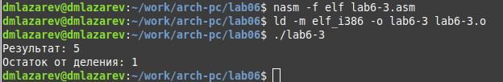

---
## Front matter
title: "Отчёт по лабораторной работе №6"
subtitle: "Дисциплина: Архитектура компьютеров"
author: "Лазарев Даниил Михайлович"

## Generic otions
lang: ru-RU
toc-title: "Содержание"

## Bibliography
bibliography: bib/cite.bib
csl: pandoc/csl/gost-r-7-0-5-2008-numeric.csl

## Pdf output format
toc: true # Table of contents
toc-depth: 2
lof: true # List of figures
fontsize: 12pt
linestretch: 1.5
papersize: a4
documentclass: scrreprt
## I18n polyglossia
polyglossia-lang:
  name: russian
  options:
	- spelling=modern
	- babelshorthands=true
polyglossia-otherlangs:
  name: english
## I18n babel
babel-lang: russian
babel-otherlangs: english
## Fonts
mainfont: PT Serif
romanfont: PT Serif
sansfont: PT Sans
monofont: PT Mono
mainfontoptions: Ligatures=TeX
romanfontoptions: Ligatures=TeX
sansfontoptions: Ligatures=TeX,Scale=MatchLowercase
monofontoptions: Scale=MatchLowercase,Scale=0.9
## Biblatex
biblatex: true
biblio-style: "gost-numeric"
biblatexoptions:
  - parentracker=true
  - backend=biber
  - hyperref=auto
  - language=auto
  - autolang=other*
  - citestyle=gost-numeric
## Pandoc-crossref LaTeX customization
figureTitle: "Рис."
tableTitle: "Таблица"
listingTitle: "Листинг"
lofTitle: "Список иллюстраций"
lolTitle: "Листинги"
## Misc options
indent: true
header-includes:
  - \usepackage{indentfirst}
  - \usepackage{float} # keep figures where there are in the text
  - \floatplacement{figure}{H} # keep figures where there are in the text
---

# Цель работы

Освоение арифметических инструкций языка ассемблера NASM.

# Задание

1. Выполнение лабораторной работы №6
2. Заполнение отчета по выполнению лабораторной работы №6 с помощью языка разметки Markdown
3. Выполнение заданий для самостоятельной работы

# Теоретическое введение

Большинство инструкций на языке ассемблера требуют обработки операндов. Адрес операнда предоставляет место, где хранятся данные, подлежащие обработке. Это могут быть данные хранящиеся в регистре или в ячейке памяти. Далее рассмотрены все существующие способы задания адреса хранения операндов – способы адресации. Существует три основных способа адресации:
• Регистровая адресация – операнды хранятся в регистрах и в команде используются имена этих регистров, например: mov ax,bx.
• Непосредственная адресация – значение операнда задается непосредственно в команде, Например: mov ax,2.
• Адресация памяти – операнд задает адрес в памяти. В команде указывается символическое обозначение ячейки памяти, над содержимым которой требуется выполнить операцию.

# Выполнение лабораторной работы

  Создадим каталог для программ лаб. работы н.6, перейдем в него и создадим файл "lab6-1.asm" (рис. @fig:1)

{#fig:1 width=100%}

  Введем в созданный файл текст программы из предложенного нам листинга 6.1(рис. @fig:2)
  
{#fig:2 width=100%}
  
  Создадим исполняемый файл и запустим его, предварительно скопировав из предыдущей лаб. работы файл "in_out.asm" для корректной работы (рис. @fig:3)
  
{#fig:3 width=100%}
 
  Далее изменим часть строк в исходном файле. (рис. @fig:4)
  
{#fig:4 width=100%}

  Преобразуем в исполняемый файо и проверим правильность выполнения. (рис. @fig:5)
  
{#fig:4 width=100%}
 
  Предварительно создав файл "lab6-2.asm" в нашем каталоге, вставим в него предложенный нам листинг 6.2 (рис. @fig:6)

{#fig:6 width=100%}

  Преобразуем файл в исполняемый и проверим правильность выполнения. (рис. @fig:7)

{#fig:7 width=100%}

  Изменим часть строк в коде программы, преобразуем в исполняемый файл и проверим правильность выполнения. (рис. @fig:8)

{#fig:8 width=100%}

  Создадим файл "lab6-3.asm" в каталоге и вставим в него предложенный нам листинг 6.3 (рис. @fig:9)

{#fig:9 width=100%}

  Преобразуем его в исполняемый файл и проверим правильность выполнения (рис. @fig:10)

{#fig:10 width=100%}

  Исправим листинг 6.3 так, чтобы выполнялась функция (4*6+2)/5 (рис. @fig:11)

{#fig:11 width=100%}

  Преобразуем файл в исполняемый и проверим правильность работы (рис. @fig:12)

{#fig:12 width=100%}

  Создадим файл "variant.asm" и вставим в него предложенный нам листинг 6.4 (рис. @fig:13)

{#fig:13 width=100%}

  Преобразуем созданный нами файл в исполняемый и проверим работоспособность (рис. @fig:14)

{#fig:14 width=100%}

  Ответим на вопросы, поставленные посли листинга 6.4 (рис. @fig:15)

{#fig:15 width=100%}

# Выполнение самостоятельной работы
  
  Основываясь на результате файла "variant.asm" выберем функцию из таблицы, в нашем случае это - 10+(31*х-5). Самостоятельно напишем код программы, который будет проводить вычисления относительно введенного х. (рис. @fig:16)

{#fig:16 width=100%}

  Преобразуем файл в исполняемый и проверим правильность выполнения работы относительно заданных нам х (3 и 1) (рис. @fig:17)

{#fig:17 width=100%}
 
# Выводы

В ходе лабораторной работы мы освоили арифметические операции на языке NASM.
