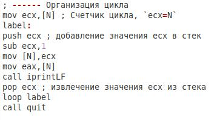
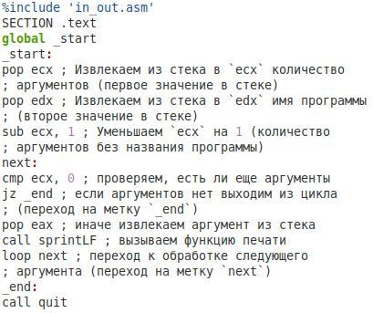

---
## Front matter
title: "Отчёт по лабораторной работе №8"
subtitle: "Дисциплина: Архитектура компьютеров"
author: "Лазарев Даниил Михайлович"

## Generic otions
lang: ru-RU
toc-title: "Содержание"

## Bibliography
bibliography: bib/cite.bib
csl: pandoc/csl/gost-r-7-0-5-2008-numeric.csl

## Pdf output format
toc: true # Table of contents
toc-depth: 2
lof: true # List of figures
fontsize: 12pt
linestretch: 1.5
papersize: a4
documentclass: scrreprt
## I18n polyglossia
polyglossia-lang:
  name: russian
  options:
	- spelling=modern
	- babelshorthands=true
polyglossia-otherlangs:
  name: english
## I18n babel
babel-lang: russian
babel-otherlangs: english
## Fonts
mainfont: PT Serif
romanfont: PT Serif
sansfont: PT Sans
monofont: PT Mono
mainfontoptions: Ligatures=TeX
romanfontoptions: Ligatures=TeX
sansfontoptions: Ligatures=TeX,Scale=MatchLowercase
monofontoptions: Scale=MatchLowercase,Scale=0.9
## Biblatex
biblatex: true
biblio-style: "gost-numeric"
biblatexoptions:
  - parentracker=true
  - backend=biber
  - hyperref=auto
  - language=auto
  - autolang=other*
  - citestyle=gost-numeric
## Pandoc-crossref LaTeX customization
figureTitle: "Рис."
tableTitle: "Таблица"
listingTitle: "Листинг"
lofTitle: "Список иллюстраций"
lolTitle: "Листинги"
## Misc options
indent: true
header-includes:
  - \usepackage{indentfirst}
  - \usepackage{float} # keep figures where there are in the text
  - \floatplacement{figure}{H} # keep figures where there are in the text
---

# Цель работы

Приобретение навыков написания программ с использованием циклов и обработкой аргументов командной строки.

# Теоретическое введение

    Стек — это структура данных, организованная по принципу LIFO («Last In — First Out» или «последним пришёл — первым ушёл»). Стек является частью архитектуры процессора и реализован на аппаратном уровне. Для работы со стеком в процессоре есть специальные регистры (ss, bp, sp) и команды. 
    Основной функцией стека является функция сохранения адресов возврата и передачи аргументов при вызове процедур. Кроме того, в нём выделяется память для локальных переменных и могут временно храниться значения регистров. 
    Стек имеет вершину, адрес последнего добавленного элемента, который хранится в регистре esp (указатель стека). Противоположный конец стека называется дном. Значение, помещённое в стек последним, извлекается первым. При помещении значения в стек указатель стека уменьшается, а при извлечении — увеличивается.
    Для стека существует две основные операции:
• добавление элемента в вершину стека (push);
• извлечение элемента из вершины стека (pop).

# Выполнение лабораторной работы

  Создадим каталог для программ лаб. работы н.8, перейдем в него и создадим файл "lab8-1.asm" (рис. @fig:1)

{#fig:1 width=100%}

  Введем в созданный файл текст программы из предложенного нам листинга 8.1 (рис. @fig:2)
  
{#fig:2 width=100%}
  
  Создадим исполняемый файл и запустим его, предварительно скопировав из предыдущей лаб. работы файл "in_out.asm" для корректной работы (рис. @fig:3)
  
{#fig:3 width=100%}
 
  Далее изменим часть текста. (рис. @fig:4)
  
{#fig:4 width=100%}

  Преобразуем в исполняемый файл и проверим правильность выполнения. (рис. @fig:5)
  
{#fig:4 width=100%}
 
  Изменим текст листинга повторно. (рис. @fig:6)

{#fig:6 width=100%}

  Преобразуем файл в исполняемый и проверим правильность выполнения. (рис. @fig:7)

{#fig:7 width=100%}

  Создадим файл "lab8-2.asm" и вставим в него предложенный нам листинг 8.2 (рис. @fig:8)

{#fig:8 width=100%}

  Преобразуем файл "lab8-2.asm" в исполняемый и проверим правильность выполнения. (рис. @fig:9)

{#fig:9 width=100%}

  Создадим файл "lab8-3.asm" и вставим в него предложенный нам листинг 8.3. (рис. @fig:10)

{#fig:10 width=100%}

  Преобразуем файл "lab8-3.asm" в исполняемый и проверим правильность выполнения. (рис. @fig:11)

{#fig:11 width=100%}

  Изменим текст листинга 8.3 так, чтобы аргументы после подставления в функцию не складывались, а умножались. (рис. @fig:13)

{#fig:13 width=100%}

  Преобразуем файл в исполняемый и проверим работоспособность (рис. @fig:16)

{#fig:16 width=100%}

# Выполнение самостоятельной работы
  
  Основываясь на результате файла "variant.asm" из лаб. работы н.6 выберем из таблицы 8.1 9 номер варианта. (рис. @fig:12)

{#fig:12 width=100%}

  Самостоятельно напишем код так, чтобы после подставления в функцию "10х-4" все переменные суммировались. (рис. @fig:14)

{#fig:14 width=100%}

  Преобразуем написанный нами файл в исполняемый и проверим правильность выполнения. (рис. @fig:15)

{#fig:15 width=100%}
 
# Выводы

В ходе лабораторной работы мы освоили навыки написания программ с использованием циклов и обработкой аргументов командной строки.

