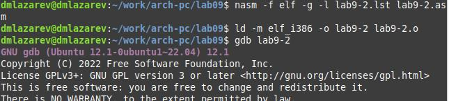
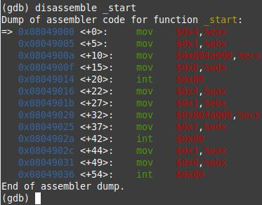

---
## Front matter
title: "Отчёт по лабораторной работе №9"
subtitle: "Дисциплина: Архитектура компьютеров"
author: "Лазарев Даниил Михайлович"

## Generic otions
lang: ru-RU
toc-title: "Содержание"

## Bibliography
bibliography: bib/cite.bib
csl: pandoc/csl/gost-r-7-0-5-2008-numeric.csl

## Pdf output format
toc: true # Table of contents
toc-depth: 2
lof: true # List of figures
fontsize: 12pt
linestretch: 1.5
papersize: a4
documentclass: scrreprt
## I18n polyglossia
polyglossia-lang:
  name: russian
  options:
	- spelling=modern
	- babelshorthands=true
polyglossia-otherlangs:
  name: english
## I18n babel
babel-lang: russian
babel-otherlangs: english
## Fonts
mainfont: PT Serif
romanfont: PT Serif
sansfont: PT Sans
monofont: PT Mono
mainfontoptions: Ligatures=TeX
romanfontoptions: Ligatures=TeX
sansfontoptions: Ligatures=TeX,Scale=MatchLowercase
monofontoptions: Scale=MatchLowercase,Scale=0.9
## Biblatex
biblatex: true
biblio-style: "gost-numeric"
biblatexoptions:
  - parentracker=true
  - backend=biber
  - hyperref=auto
  - language=auto
  - autolang=other*
  - citestyle=gost-numeric
## Pandoc-crossref LaTeX customization
figureTitle: "Рис."
tableTitle: "Таблица"
listingTitle: "Листинг"
lofTitle: "Список иллюстраций"
lolTitle: "Листинги"
## Misc options
indent: true
header-includes:
  - \usepackage{indentfirst}
  - \usepackage{float} # keep figures where there are in the text
  - \floatplacement{figure}{H} # keep figures where there are in the text
---

# Цель работы

Приобретение навыков написания программ с использованием подпрограмм. Знакомство с методами отладки при помощи GDB и его основными возможностями.

# Теоретическое введение

    Отладка — это процесс поиска и исправления ошибок в программе. В общем случае его можно разделить на четыре этапа:
• обнаружение ошибки;
• поиск её местонахождения;
• определение причины ошибки;
• исправление ошибки.
Можно выделить следующие типы ошибок:
• синтаксические ошибки — обнаруживаются во время трансляции исходного кода и вызваны нарушением ожидаемой формы или структуры языка;
• семантические ошибки — являются логическими и приводят к тому, что программа запускается, отрабатывает, но не даёт желаемого результата;
• ошибки в процессе выполнения — не обнаруживаются при трансляции и вызывают прерывание выполнения программы (например, это ошибки, связанные с переполнением или делением на ноль).

# Выполнение лабораторной работы

    Создадим каталог для программ лаб. работы н.9, перейдем в него и создадим файл "lab9-1.asm" (рис. @fig:1)

{#fig:1 width=100%}

    Введем в созданный файл текст программы из предложенного нам листинга 9.1 (рис. @fig:2)
  
{#fig:2 width=100%}
  
    Создадим исполняемый файл и запустим его, предварительно скопировав из предыдущей лаб. работы файл "in_out.asm" для корректной работы (рис. @fig:3)
  
{#fig:3 width=100%}
 
    Далее дополним код так, чтобы Х проходил еще через одну функцию. (рис. @fig:4)
  
{#fig:4 width=100%}

    Преобразуем в исполняемый файл и проверим правильность выполнения. (рис. @fig:5)
  
{#fig:4 width=100%}

    Создадим файл "lab9-2.asm" и вставим в него предложенный нам листинг 9.2 (рис. @fig:6)

{#fig:6 width=100%}

    Преобразуем файл "lab9-2.asm" в исполняемый, добавив в него отладочную информацию. (рис. @fig:7)

{#fig:7 width=100%}
  
    Загрузим исполняемый файл в отладчик gdb и запустим программу с помощью команды "run" для проверки ее работоспособности.(рис. @fig:8)

{#fig:8 width=100%}

    Установим брейкпоинт с помощью команды "break" для более подробного анализа и запустим повторно.(рис. @fig:9)

{#fig:9 width=100%}

    Просмотрим код с помощью команды "disassemble".(рис. @fig:10)

{#fig:10 width=100%}

    Включим отображение команд на синтаксисе Интела.(рис. @fig:11)

{#fig:11 width=100%}

    Включим режим псевдографики для более удобного анализа программы.(рис. @fig:12; рис. @fig:13)

{#fig:12 width=100%}
{#fig:13 width=100%}

    Проверим все установленные брейкпоинты и установим еще одну точку остановки по адресу инструкции.(рис. @fig:14)

{#fig:14 width=100%}

    Просмотрим значение переменной msg1 по имени.(рис. @fig:15)

{#fig:15 width=100%}

    Просмотрим значение переменной msg2 по адресу. (рис. @fig:16)

{#fig:16 width=100%}

    Изменим первый символ переменной msg1. (рис. @fig:17)

{#fig:17 width=100%}

    Так же изменим второй символ во второй переменной msg2 (рис. @fig:18)

{#fig:18 width=100%}

    С помощью команды "set" изменим значение регистра ebx. Разница вывода в том, что во втором случае мы задаем число, которое нам необходимо, не зависимо от заложенного в переменную, а в первом первые два символа. (рис. @fig:19)

{#fig:19 width=100%}

    Скопируем файл "lab8-2.asm" созданный при выполнении предыдущей лабораторной работы и переименуем в "lab9-3.asm" (рис. @fig:20)

{#fig:20 width=100%}

    Преобразуем файл в исполняемый. (рис. @fig:21)

{#fig:21 width=100%}

    Загрузим программу в gdb с использованием ключа --args и указав 3 аргумента. Установим точку остановки перед первой инструкцией в программе и запустим ее. (рис. @fig:22)

{#fig:22 width=100%}

    Введя команду "x/x $esp" увидим то, что аргументов командной строки 4(включая название файла).(рис. @fig:23)

{#fig:23 width=100%}

# Выполнение самостоятельной работы
  
    Преобразуем программу из предыдущей лабораторной работы реализовав вычисление значения функции как подпрограмму. (рис. @fig:24)

{#fig:24 width=100%}

  Создадим файл "lab9-4.asm" и внесем в него листинг 9.3. С помощью gdb проанализируем и найдем ошибку в коде. (рис. @fig:25)

{#fig:25 width=100%}

  Исправим ошибку в коде. (рис. @fig:26)

{#fig:26 width=100%}
 
# Выводы

В ходе лабораторной работы мы научились написанию программ с использованием подпрограмм, а так же с отладкой программ с помощью GDB.

