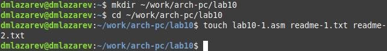
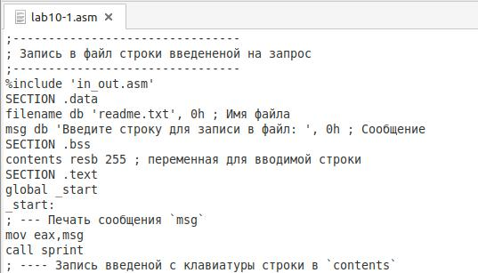
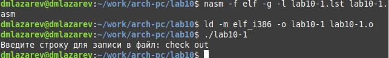
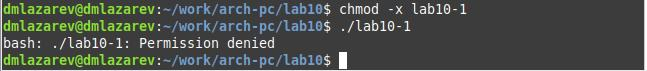
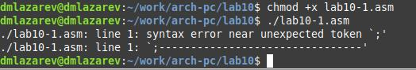
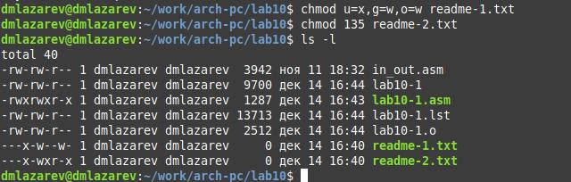
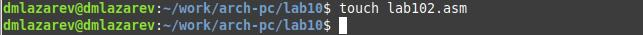
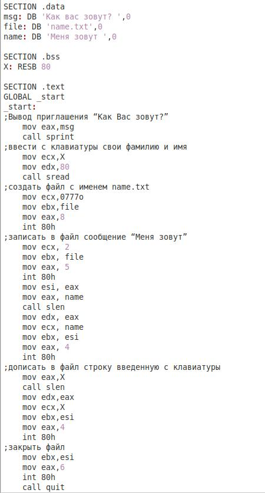
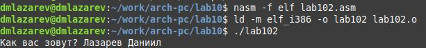
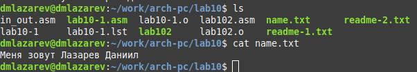

---
## Front matter
title: "Отчёт по лабораторной работе №10"
subtitle: "Дисциплина: Архитектура компьютеров"
author: "Лазарев Даниил Михайлович"

## Generic otions
lang: ru-RU
toc-title: "Содержание"

## Bibliography
bibliography: bib/cite.bib
csl: pandoc/csl/gost-r-7-0-5-2008-numeric.csl

## Pdf output format
toc: true # Table of contents
toc-depth: 2
lof: true # List of figures
fontsize: 12pt
linestretch: 1.5
papersize: a4
documentclass: scrreprt
## I18n polyglossia
polyglossia-lang:
  name: russian
  options:
	- spelling=modern
	- babelshorthands=true
polyglossia-otherlangs:
  name: english
## I18n babel
babel-lang: russian
babel-otherlangs: english
## Fonts
mainfont: PT Serif
romanfont: PT Serif
sansfont: PT Sans
monofont: PT Mono
mainfontoptions: Ligatures=TeX
romanfontoptions: Ligatures=TeX
sansfontoptions: Ligatures=TeX,Scale=MatchLowercase
monofontoptions: Scale=MatchLowercase,Scale=0.9
## Biblatex
biblatex: true
biblio-style: "gost-numeric"
biblatexoptions:
  - parentracker=true
  - backend=biber
  - hyperref=auto
  - language=auto
  - autolang=other*
  - citestyle=gost-numeric
## Pandoc-crossref LaTeX customization
figureTitle: "Рис."
tableTitle: "Таблица"
listingTitle: "Листинг"
lofTitle: "Список иллюстраций"
lolTitle: "Листинги"
## Misc options
indent: true
header-includes:
  - \usepackage{indentfirst}
  - \usepackage{float} # keep figures where there are in the text
  - \floatplacement{figure}{H} # keep figures where there are in the text
---

# Цель работы

Приобретение навыков написания программ для работы с файлами.

# Теоретическое введение

  ОС GNU/Linux является многопользовательской операционной системой. И для обеспечения защиты данных одного пользователя от действий других пользователей существуют специальные механизмы разграничения доступа к файлам. Кроме ограничения доступа, данный механизм позволяет разрешить другим пользователям доступ данным для совместной работы.
  Набор прав доступа задается тройками битов и состоит из прав на чтение, запись и исполнение файла. В символьном представлении он имеет вид строк rwx, где вместо любого символа может стоять дефис. Всего возможно 8 комбинаций, приведенных в таблице 10.1.
Буква означает наличие права (установлен в единицу второй бит триады r — чтение, первый бит w — запись, нулевой бит х — исполнение), а дефис означает отсутствие права (нулевое значение соответствующего бита). Также права доступа могут быть представлены как восьмеричное число. Так, права доступа rw- (чтение и запись, без исполнения) понимаются как три двоичные цифры 110 или как восьмеричная цифра 6.

# Выполнение лабораторной работы

  Создадим каталог для программ лаб. работы н.10, перейдем в него и создадим файл "lab10-1.asm" (рис. @fig:1)

{#fig:1 width=100%}

  Введем в созданный файл текст программы из предложенного нам листинга 10.1 (рис. @fig:2)
  
{#fig:2 width=100%}
  
  Создадим исполняемый файл и запустим его, предварительно скопировав из предыдущей лаб. работы файл "in_out.asm" для корректной работы (рис. @fig:3)
  
{#fig:3 width=100%}
 
  С  помощью команды chmod изменим права доступа к созданному нами исполняемому файлу так, чтобы присутствовал запрет на его выполнение. При попытке выполнения получим отказ. Следовательно, команда chmod была введена с верными ключами. (рис. @fig:4)
  
{#fig:4 width=100%}

  С помощью команды chmod изменим права доступа к изначальному  файлу "lab10-1.asm" с текстом листинга так, чтобы присутствовали права на его выполнение. Поскольку файл содержит в себе исходный код на языке ассемблера, то добавление права на исполнение не даст нам ожидаемого результата, а лишь выведет ошибку. Чтобы выполнить данный файл, необходимо предварительно его превратить в исполняемый. (рис. @fig:5)
  
{#fig:4 width=100%}
 
  Далее, из таблицы 10.4 выберем 9 вариант и изменим права для файлов "readme-1.txt" и "readme-2.txt" в соответствии с ней. Проверим правильность выполнения. (рис. @fig:6)

{#fig:6 width=100%}

# Выполнение самостоятельной работы
  
  Создадим файл "lab102.asm" для выполнения самостоятельной работы. (рис. @fig:7)

{#fig:7 width=100%}

  Напишем код, работающий по алгоритму, запрошенному в гайде к лабораторной работе. (рис. @fig:8)

{#fig:8 width=100%}

  Преобразуем написанный нами файл в исполняемый и введем требуемую от нас информацию. (рис. @fig:9)

{#fig:9 width=100%}

  Проверим правильность выполнения кода, просмотрев содержимое файла "name.txt" (рис. @fig:10)

{#fig:10 width=100%}
 
# Выводы

В ходе лабораторной работы мы преобрели навыки написания программ для работы с файлами.

